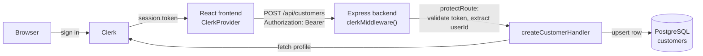
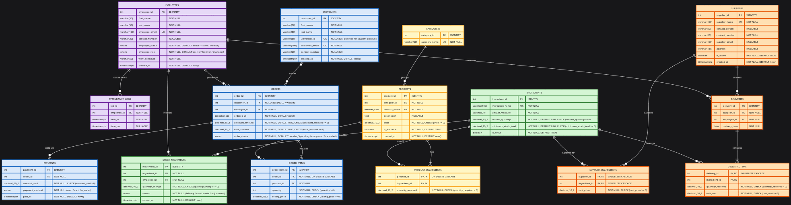

<div align="center">
  

# Bull's Coffee

<em>A campus coffee shop, digitized — ordering, staff, and inventory in one place.</em>

[](https://react.dev)
[](https://www.typescriptlang.org)
[](https://expressjs.com)
[](https://www.postgresql.org)
[](https://clerk.com)
[](https://vitejs.dev)
[](https://tailwindcss.com)

A React + Express app for a university coffee shop: customers sign in with
Clerk and get auto-registered against a PostgreSQL schema that models staff,
menu, inventory, sales, and suppliers end to end.

</div>

<br>

## Contents

- [Project Status](#-project-status)
- [Quick Start](#-quick-start)
- [Features](#-features)
- [Tech Stack](#-tech-stack)
- [Authentication (Clerk)](#-authentication-clerk)
- [API Reference](#-api-reference)
- [Database Schema](#-database-schema)
- [Project Structure](#-project-structure)
- [Common Commands](#-common-commands)
- [Troubleshooting](#-troubleshooting)

## 🚧 Project Status

This is an active student project, not a finished product. What exists today:

- ✅ Clerk sign-in wired up end to end (frontend + backend), with automatic
  customer registration on first sign-in
- ✅ Full relational schema for staff, sales, menu, inventory, and supply
  (see [Database Schema](#-database-schema))
- ✅ CRUD APIs for **employees**, **customers**, and **suppliers**
- ✅ Landing page hero
- 🔜 Not yet built: menu browsing, cart/checkout, order and payment
  endpoints, inventory/stock-movement endpoints, and a staff-facing
  dashboard
- ⚠️ Only the `POST /api/customers` route currently requires a Clerk
  session; the employee and supplier routes are not yet auth-protected —
  don't expose this API publicly as-is

## ⚡ Quick Start

There's no Docker setup yet — run the backend, frontend, and PostgreSQL
directly.

### 1. Database

```bash
# Make sure PostgreSQL is running locally, then create the database
createdb coffeedemo
```

Schema creation is automatic: the backend runs `backend/init.sql` on every
startup (`CREATE TABLE IF NOT EXISTS…`), so there's no separate migration
step.

### 2. Backend

```bash
cd backend
npm install
cp .env.example .env
# edit .env: set DATABASE_URL, then add CLERK_SECRET_KEY (see below)
npm run dev
```

The API starts on **http://localhost:3000** (see `PORT` in `.env`).

### 3. Frontend

```bash
cd frontend
npm install
# create frontend/.env with:
#   VITE_CLERK_PUBLISHABLE_KEY=pk_test_...
#   VITE_API_URL=http://localhost:3000   (optional, this is the default)
npm run dev
```

The app starts on **http://localhost:5173**.

### First-time Clerk setup

Both the frontend and backend need keys from the same
[Clerk application](https://dashboard.clerk.com/):

- Backend `.env`: `CLERK_SECRET_KEY`, `CLERK_PUBLISHABLE_KEY`
- Frontend `.env`: `VITE_CLERK_PUBLISHABLE_KEY`

## ✨ Features

|     | Feature                | Details                                                                                    |
| --- | ----------------------- | ------------------------------------------------------------------------------------------- |
| 🔐  | **Sign-in**             | Clerk-hosted authentication on the frontend                                                 |
| 🙋  | **Auto-registration**   | On first sign-in, the frontend calls the backend to create a matching `customers` row, pulling name/email from Clerk |
| 📝  | **Fallback name form**  | If Clerk has no name on file, the customer is prompted for one before registration completes |
| 👥  | **Staff records**       | Employees with role (`cashier` / `manager`), status, and work schedule                      |
| 🚚  | **Supplier records**    | Suppliers and the ingredients they provide, with unit pricing                               |
| 🎓  | **Student discount ready** | `customers.university_id` is captured for a future student-discount flow                |

### Planned

Menu/catalog, cart & checkout, order and payment processing, inventory
stock movements, attendance logs, and a manager dashboard are modeled in
the [database schema](#-database-schema) but don't have API routes or UI
yet.

## 🧱 Tech Stack

| Layer      | Tech                                                          |
| ---------- | -------------------------------------------------------------- |
| Frontend   | React 19, TypeScript, Vite, Tailwind CSS 4                     |
| Backend    | Express 5, TypeScript (native `.ts` execution via Node's `--watch`) |
| Database   | PostgreSQL via `pg`, schema applied from a plain `init.sql`    |
| Auth       | Clerk (`@clerk/express` on the backend, `@clerk/clerk-react` on the frontend) |
| Tooling    | oxlint (frontend), `http-status-codes` for consistent API responses |

## 🔐 Authentication (Clerk)



1. The frontend wraps the app in `<ClerkProvider>` ([main.tsx](frontend/src/main.tsx)) using `VITE_CLERK_PUBLISHABLE_KEY`.
2. `CustomerProvider` ([CustomerProvider.tsx](frontend/src/auth/CustomerProvider.tsx)) watches Clerk's auth state and, on sign-in, calls `POST /api/customers` with the session token.
3. On the backend, `clerkMiddleware()` runs globally in [server.ts](backend/src/server.ts); the `protectRoute` middleware ([auth.middleware.ts](backend/src/middleware/auth.middleware.ts)) rejects unauthenticated requests and puts the Clerk `userId` on `res.locals.clerkId`.
4. `createCustomerHandler` ([customer.controller.ts](backend/src/controllers/customer.controller.ts)) looks up the Clerk profile for name/email, creates the `customers` row if one doesn't exist yet, and returns it. If Clerk has no name on file, the frontend shows a short form ([RegistrationNotice.tsx](frontend/src/auth/RegistrationNotice.tsx)) and retries.
5. `requireManager` (same middleware file) exists for gating manager-only actions but isn't wired into any route yet.

## 📋 API Reference

Base URL: `http://localhost:3000/api`. Responses are wrapped as
`{ message, data }` on success or `{ error }` on failure by
[responseFormatter.ts](backend/src/middleware/responseFormatter.ts).

| Method | Path              | Auth               | Notes                                              |
| ------ | ----------------- | ------------------- | --------------------------------------------------- |
| POST   | `/customers`      | Clerk session        | Idempotent — returns the existing row if already registered |
| GET    | `/customers`      | —                    |                                                      |
| GET    | `/customers/:id`  | —                    |                                                      |
| DELETE | `/customers/:id`  | —                    |                                                      |
| POST   | `/employees`      | —                    |                                                      |
| GET    | `/employees`      | —                    |                                                      |
| GET    | `/employees/:id`  | —                    |                                                      |
| DELETE | `/employees/:id`  | —                    |                                                      |
| POST   | `/suppliers`      | —                    |                                                      |
| GET    | `/suppliers`      | —                    |                                                      |
| GET    | `/suppliers/:id`  | —                    |                                                      |
| DELETE | `/suppliers/:id`  | —                    |                                                      |

`GET /` and `GET /health-check` are unauthenticated liveness endpoints.

## 🗄️ Database Schema

The schema covers five modules — staff, sales, menu, inventory, and
supply — defined in [init.sql](backend/init.sql) and diagrammed in
[RESET.mmd](RESET.mmd):



- Employees and customers are linked to Clerk via a unique `clerk_id`.
- `orders` support walk-in customers (`customer_id` is nullable).
- Records are retired with `is_active` / `employee_status` flags rather
  than hard-deleted, except where cascades are explicit (e.g. deleting an
  order removes its `order_items`).

## 📁 Project Structure

```
backend/
  init.sql              # full schema, applied on every server start
  src/
    server.ts           # express app, middleware, route mounting
    routes/              # one router per resource
    controllers/         # request/response handling
    providers/           # SQL queries
    middleware/           # clerk auth guards, response formatter
    types/                # shared TS types per resource

frontend/
  src/
    auth/                # ClerkProvider consumer: registration flow
    Home/Hero/            # landing page hero animation
    App.tsx / main.tsx
```

## 📋 Common Commands

```bash
# Backend
cd backend
npm run dev      # start with --watch (auto-restart on change)
npm run build    # compile TypeScript to dist/
npm run start    # run the compiled build

# Frontend
cd frontend
npm run dev       # start Vite dev server
npm run build     # type-check and build for production
npm run lint      # oxlint
npm run preview   # preview the production build
```

## 🩺 Troubleshooting

### Backend fails on startup with a database error

`runInitSql()` runs on every launch and will throw (and exit the process)
if it can't reach Postgres. Check `DATABASE_URL` in `backend/.env` and
confirm the database from `createdb` exists and is reachable.

### Sign-in works but the "Setting up your account…" toast never resolves

The frontend defaults to `http://localhost:3000` for the API
(`VITE_API_URL`). Confirm the backend is running on that port and that
`CLERK_SECRET_KEY` in `backend/.env` matches the same Clerk application as
`VITE_CLERK_PUBLISHABLE_KEY` in `frontend/.env`.

### 401 on `/api/customers`

The request needs an `Authorization: Bearer <Clerk session token>` header;
this is handled automatically by `CustomerProvider`, so a 401 there
usually means the Clerk keys on the frontend and backend don't match.

## License

No license file is included yet — all rights reserved by default until one
is added.
