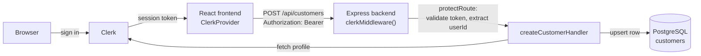
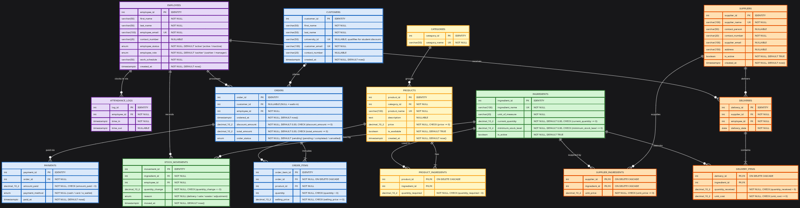

<div align="center">
  

# Bull's Coffee

<em>A campus coffee shop, digitized — ordering, staff, and inventory in one place.</em>

[](https://nodejs.org)
[](https://react.dev)
[](https://www.typescriptlang.org)
[](https://expressjs.com)
[](https://www.postgresql.org)
[](https://clerk.com)
[](https://vitejs.dev)
[](https://tailwindcss.com)

A React + Express app for a university coffee shop: customers sign in with
Clerk and get auto-registered against a PostgreSQL schema that models staff,
menu, inventory, sales, and suppliers end to end.

</div>

<br>

## Contents

- [Project Status](#-project-status)
- [Screenshots](#-screenshots)
- [Quick Start](#-quick-start)
- [Features](#-features)
- [Tech Stack](#-tech-stack)
- [Authentication (Clerk)](#-authentication-clerk)
- [API Reference](#-api-reference)
- [Database Schema](#-database-schema)
- [Project Structure](#-project-structure)
- [Common Commands](#-common-commands)
- [Troubleshooting](#-troubleshooting)

## 🚧 Project Status

This is an active student project, not a finished product. What exists today:

- ✅ Clerk sign-in and sign-up wired up end to end (frontend + backend),
  with a custom auth page (email/password + social) and automatic customer
  registration on first sign-in
- ✅ Client-side routing (React Router) for the landing page, `/menu`,
  `/about`, `/contact`, the auth pages, and two internal dashboards at
  `/admin` and `/manager`
- ✅ Full relational schema for staff, sales, menu, inventory, supply,
  feedback, and discounts (see [Database Schema](#-database-schema))
- ✅ Live CRUD APIs for **customers** (`/api`), an **admin** API for
  customers and employees (`/api/admin`), and read-only **products**
  (`/api/products`), all behind a Clerk session
- ✅ Landing page hero, animated menu showcase, order-flow and about-page
  reveal, navbar/footer
- 🟡 **Manager dashboard** ([frontend/src/Manager](frontend/src/Manager)):
  a full UI — dashboard, POS, orders, discounts, reports, feedback,
  products, staff, schedules, attendance, inventory, suppliers — but it
  runs entirely on in-memory mock data
  ([mock.ts](frontend/src/Manager/data/mock.ts)), not the real API
- 🟡 **Admin dashboard** ([frontend/src/Admin](frontend/src/Admin)): a
  separate system-admin style UI (users, roles, system health, logs,
  tickets, branches, payments, backups, …), also mock-data only
- 🟡 **Backend catching up to the schema**: controllers and providers now
  exist for categories, ingredients, products (full CRUD + recipes),
  orders, deliveries, employees, attendance, reports, stock movements,
  and suppliers, but most aren't mounted as routes yet — see
  [API Reference](#-api-reference) for exactly what's live today
  ([server.ts](backend/src/server.ts) only mounts three route files)
- ✅ S3 uploads are routed: product, category, ingredient, supplier and
  employee images, plus PDFs and private CSV logs, each in its own folder
  under `bulls-coffee/` in the bucket
  ([s3.ts](backend/src/lib/s3.ts),
  [upload.middleware.ts](backend/src/middleware/upload.middleware.ts))
- 🔜 The customer-facing `/menu` page is still a static/animated mock
  ([StaticMenu.tsx](frontend/src/Home/Menu/StaticMenu.tsx) /
  [PourShowcase](frontend/src/Home/Menu/PourShowcase.tsx)), not fetched
  from `/api/products`; cart, checkout, and payments don't exist yet
- ⚠️ Authentication is enforced on every backend route, but authorization
  is not: any signed-in user can read, update, or delete **any** customer
  or employee by ID (`requireManager` is written in
  [auth.middleware.ts](backend/src/middleware/auth.middleware.ts) but
  unused). The `/admin` and `/manager` frontend routes are likewise not
  gated behind a role check yet — anyone with the URL can open them.

## 📸 Screenshots

<!--
  Placeholders. To swap one in: save the capture as
  docs/screenshots/<name>.png (1280×720 works well) and point the
  matching  at that path instead of placehold.co.
-->

<table>
  <tr>
    <td width="50%" align="center">
      
      <br><sub><b>Landing page</b> · <code>/</code></sub>
    </td>
    <td width="50%" align="center">
      
      <br><sub><b>Menu</b> · <code>/menu</code></sub>
    </td>
  </tr>
  <tr>
    <td width="50%" align="center">
      
      <br><sub><b>Sign in / sign up</b> · Clerk-backed auth page</sub>
    </td>
    <td width="50%" align="center">
      
      <br><sub><b>Self-order kiosk</b> · <code>/kiosk</code></sub>
    </td>
  </tr>
  <tr>
    <td width="50%" align="center">
      
      <br><sub><b>Point of sale</b> · <code>/pos</code></sub>
    </td>
    <td width="50%" align="center">
      
      <br><sub><b>Checkout</b> · <code>/checkout</code></sub>
    </td>
  </tr>
  <tr>
    <td width="50%" align="center">
      
      <br><sub><b>Manager dashboard</b> · <code>/manager</code></sub>
    </td>
    <td width="50%" align="center">
      
      <br><sub><b>Admin dashboard</b> · <code>/admin</code></sub>
    </td>
  </tr>
</table>

## ⚡ Quick Start

There's no Docker setup yet — run the backend, frontend, and PostgreSQL
directly.

### 1. Database

```bash
# Make sure PostgreSQL is running locally, then create the database
createdb coffeedemo
```

Schema creation is automatic: the backend runs `backend/init.sql` on every
startup (`CREATE TABLE IF NOT EXISTS…`), so there's no separate migration
step.

### 2. Backend

```bash
cd backend
npm install
cp .env.example .env
# edit .env: set DATABASE_URL, then add CLERK_SECRET_KEY (see below)
npm run dev
```

The API starts on **http://localhost:3000** (see `PORT` in `.env`). The
`AWS_*` variables in `.env.example` are used for file uploads — the server
boots without them, but uploads then fail with "S3 is not configured".

### 3. Frontend

```bash
cd frontend
npm install
# create frontend/.env with:
#   VITE_CLERK_PUBLISHABLE_KEY=pk_test_...
#   VITE_API_URL=http://localhost:3000   (optional, this is the default)
npm run dev
```

The app starts on **http://localhost:5173**.

### First-time Clerk setup

Both the frontend and backend need keys from the same
[Clerk application](https://dashboard.clerk.com/):

- Backend `.env`: `CLERK_SECRET_KEY`, `CLERK_PUBLISHABLE_KEY`
- Frontend `.env`: `VITE_CLERK_PUBLISHABLE_KEY`

## ✨ Features

|     | Feature                | Details                                                                                    |
| --- | ----------------------- | ------------------------------------------------------------------------------------------- |
| 🔐  | **Sign-in**             | Clerk-hosted authentication on the frontend                                                 |
| 🙋  | **Auto-registration**   | On first sign-in, the frontend calls the backend to create a matching `customers` row, pulling name/email from Clerk |
| 📝  | **Fallback name form**  | If Clerk has no name on file, the customer is prompted for one before registration completes |
| 👥  | **Staff records**       | Employees with role (`cashier` / `manager`), status, and work schedule                      |
| 🚚  | **Supplier records**    | Full CRUD on the backend (controller + provider); no route mounted yet, no UI wired to it   |
| 🎓  | **Student discount ready** | `customers.university_id` + a new `discounts` table are captured for a future student-discount flow |
| 🧭  | **Site navigation**     | Navbar/footer and routed sections for home, menu, about, and contact                        |
| 🔑  | **Custom auth UI**      | Clerk-backed sign-in/sign-up page with email/password, social buttons, and password reset   |
| 📊  | **Manager dashboard**   | 12-page UI (POS, orders, discounts, reports, feedback, products, staff, schedules, attendance, inventory, suppliers) — currently mock-data only, see [Project Status](#-project-status) |
| 🛠️  | **Admin dashboard**     | 11-page system-admin UI (users, roles, health, logs, tickets, branches, payments, …) — also mock-data only |
| ☁️  | **File uploads**        | S3 via multer: menu/supplier/staff images and PDFs (public), CSV logs (private, manager/admin only) |

### Planned

Wiring the Manager/Admin UIs to the real API, a customer-facing menu backed by `/api/products`, cart & checkout,
order and payment processing, and role-based authorization
(`requireManager`) are the next milestones. Most of the backend surface
for these (controllers + providers for categories, ingredients, orders,
deliveries, attendance, reports, stock movements, and suppliers) already
exists — see [API Reference](#-api-reference) for what's actually routed
today.

## 🧱 Tech Stack

| Layer      | Tech                                                          |
| ---------- | -------------------------------------------------------------- |
| Frontend   | React 19, TypeScript, Vite, Tailwind CSS 4, `react-icons`, `motion` (animation) |
| Backend    | Express 5, TypeScript (native `.ts` execution via Node's `--watch`) |
| Database   | PostgreSQL via `pg`, schema applied from a plain `init.sql`    |
| Auth       | Clerk (`@clerk/express` on the backend, `@clerk/clerk-react` on the frontend) |
| File storage | AWS S3 (`@aws-sdk/client-s3`) via `multer`, under `bulls-coffee/` in the bucket |
| Tooling    | oxlint (frontend), `http-status-codes` for consistent API responses |

## 🔐 Authentication (Clerk)


```mermaid
flowchart LR
    U["Browser"] -->|"sign in"| C["Clerk"]
    C -->|"session token"| FE["React frontend\nClerkProvider"]
    FE -->|"POST /api/customers\nAuthorization: Bearer <token>"| BE["Express backend\nclerkMiddleware()"]
    BE -->|"protectRoute:\nvalidate token, extract userId"| H["createCustomerHandler"]
    H -->|"fetch profile"| C
    H -->|"upsert row"| DB[("PostgreSQL\ncustomers")]
```

1. The frontend wraps the app in `<ClerkProvider>` ([main.tsx](frontend/src/main.tsx)) using `VITE_CLERK_PUBLISHABLE_KEY`.
2. `CustomerProvider` ([CustomerProvider.tsx](frontend/src/auth/CustomerProvider.tsx)) watches Clerk's auth state and, on sign-in, calls `POST /api/customers` with the session token.
3. On the backend, `clerkMiddleware()` runs globally in [server.ts](backend/src/server.ts); the `protectRoute` middleware ([auth.middleware.ts](backend/src/middleware/auth.middleware.ts)) rejects unauthenticated requests and puts the Clerk `userId` on `res.locals.clerkId`.
4. `createCustomerHandler` ([customer.controller.ts](backend/src/controllers/customer.controller.ts)) looks up the Clerk profile for name/email, creates the `customers` row if one doesn't exist yet, and returns it. If Clerk has no name on file, the frontend shows a short form ([RegistrationNotice.tsx](frontend/src/auth/RegistrationNotice.tsx)) and retries.
5. Every other route is wrapped in `protectRoute` too, so an unauthenticated request never reaches a handler. There is no role-based guard yet — a manager-only check still needs to be written.

## 📋 API Reference

Base URL: `http://localhost:3000/api`. Responses are wrapped as
`{ message, data }` on success or `{ error }` on failure by
[responseFormatter.ts](backend/src/middleware/responseFormatter.ts).

These are the only routes actually mounted in
[server.ts](backend/src/server.ts) today. All of them except the product
and kiosk endpoints require a Clerk session (`Authorization: Bearer <token>`).

| Method | Path                    | Notes                                                       |
| ------ | ----------------------- | ----------------------------------------------------------- |
| POST   | `/customers`            | Idempotent — returns the existing row if already registered |
| GET    | `/customers`            | List all customers                                          |
| GET    | `/customers/:id`        |                                                              |
| PUT    | `/customers/:id`        | Update profile                                              |
| DELETE | `/customers/:id`        |                                                              |
| POST   | `/admin/customers`      | Same upsert-on-first-sign-in behavior as `POST /customers`  |
| GET    | `/admin/customers`      | List all customers                                          |
| GET    | `/admin/customers/:id`  |                                                              |
| DELETE | `/admin/customers/:id`  |                                                              |
| POST   | `/admin/employees`      |                                                              |
| GET    | `/admin/employees`      |                                                              |
| GET    | `/admin/employees/:id`  |                                                              |
| DELETE | `/admin/employees/:id`  |                                                              |
| GET    | `/products`             | List all products — no auth required                        |
| GET    | `/products/:id`         | No auth required                                             |
| POST   | `/kiosk/orders`         | No auth required; rate limited to 30 requests per 5 minutes per IP. Self-order from `/kiosk`: `{ items: [{ product_id, quantity, size?, special_instructions? }] }`. Priced server-side, saved as pending with no cashier until it's paid at the counter; linked to the customer when a Clerk session is sent |

The `/customers` and `/admin/customers` handlers are near-duplicates backed
by two separate providers ([customer.provider.ts](backend/src/providers/customer.provider.ts),
[admin.provider.ts](backend/src/providers/admin.provider.ts)); they should be
consolidated.

`GET /` and `GET /health-check` are unauthenticated liveness endpoints.

### Controllers that exist but aren't routed yet

The backend has full controllers + providers for these resources, but no
route file mounts them, so none of this is reachable over HTTP yet:
categories, ingredients, the rest of products' CRUD (create/update/delete
+ recipe management), orders, deliveries, employees (beyond the admin
list/create/delete above), attendance, reports, stock movements, and
suppliers. See `backend/src/controllers/*.controller.ts` for what each one
does — wiring these up is the main backend gap right now.

## 🗄️ Database Schema

The schema covers staff, sales, menu, inventory, supply, feedback, and
discounts — defined in [init.sql](backend/init.sql) and diagrammed in
[RESET.mmd](RESET.mmd):



- Employees and customers are linked to Clerk via a unique `clerk_id`.
- `orders` support walk-in customers (`customer_id` is nullable).
- Records are retired with `is_active` / `employee_status` flags rather
  than hard-deleted, except where cascades are explicit (e.g. deleting an
  order removes its `order_items`).
- `products` can have per-size variants (`has_sizes` + the `item_size`
  enum on `order_items`), and `order_items` carries free-text
  `special_instructions`.
- `feedback` (rating + comment per order) and `discounts` (percent/fixed,
  with an eligibility rule) are new tables backing the Manager
  dashboard's Feedback and Discounts pages — no API reads/writes them
  yet, so the dashboard's data is still mocked.
- ⚠️ `RESET.mmd` includes these newer tables, but `RESET.png` hasn't been
  regenerated since — the rendered diagram above is stale.

## 📁 Project Structure

```
backend/
  init.sql              # full schema, applied on every server start
  src/
    server.ts           # express app, middleware, route mounting
    routes/              # only 3 files mounted: customer, admin, product — see API Reference
    controllers/         # request/response handling (many more resources than have routes)
    providers/           # SQL queries
    middleware/           # clerk auth guards, response formatter, S3 upload
    types/                # shared TS types per resource
    lib/                  # init.sql runner, query helpers

frontend/
  src/
    AuthPage/             # custom sign-in/sign-up UI (Clerk-backed), password reset, social buttons
    auth/                 # ClerkProvider wiring + registration flow (CustomerProvider, RegistrationNotice)
    components/           # Navbar, Footer
    Home/                  # Home.tsx + Hero/About/Contact/Menu sections (animated, mock data)
    Manager/               # /manager — coffee-shop manager dashboard (mock data, see Project Status)
      components/, layout/, pages/, data/, utils/
    Admin/                 # /admin — system-admin dashboard (mock data, see Project Status)
      pages/, layout/, data/
    POS/                   # placeholder, currently empty
    App.tsx / main.tsx
```

## 📋 Common Commands

```bash
# Backend
cd backend
npm run dev      # start with --watch (auto-restart on change)
npm run build    # compile TypeScript to dist/
npm run start    # run the compiled build

# Frontend
cd frontend
npm run dev       # start Vite dev server
npm run build     # type-check and build for production
npm run lint      # oxlint
npm run preview   # preview the production build
```

## 🩺 Troubleshooting

### Backend fails on startup with a database error

`runInitSql()` runs on every launch and will throw (and exit the process)
if it can't reach Postgres. Check `DATABASE_URL` in `backend/.env` and
confirm the database from `createdb` exists and is reachable.

### Sign-in works but the "Setting up your account…" toast never resolves

The frontend defaults to `http://localhost:3000` for the API
(`VITE_API_URL`). Confirm the backend is running on that port and that
`CLERK_SECRET_KEY` in `backend/.env` matches the same Clerk application as
`VITE_CLERK_PUBLISHABLE_KEY` in `frontend/.env`.

### 401 on `/api/customers`

The request needs an `Authorization: Bearer <Clerk session token>` header;
this is handled automatically by `CustomerProvider`, so a 401 there
usually means the Clerk keys on the frontend and backend don't match.

## License

No license file is included yet — all rights reserved by default until one
is added.
