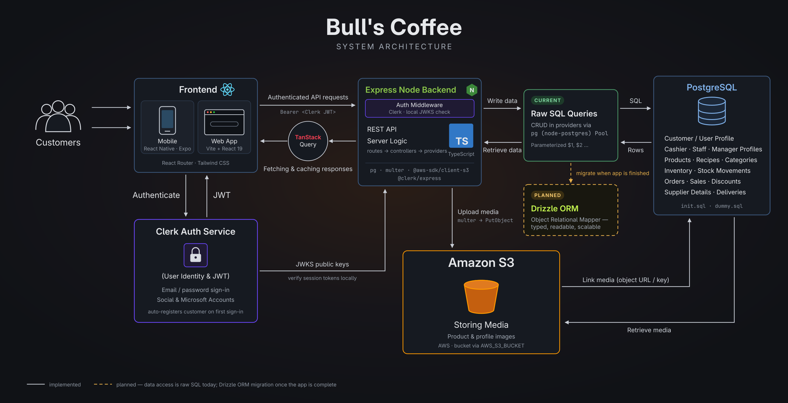
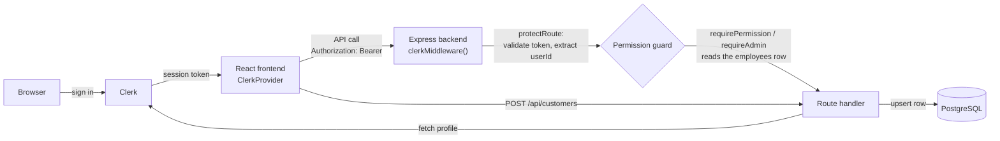

<div align="center">
  

# Bull's Coffee

<em>A campus coffee shop, digitized — ordering, payments, staff, inventory, and system administration in one place.</em>

[](https://nodejs.org)
[](https://react.dev)
[](https://www.typescriptlang.org)
[](https://expressjs.com)
[](https://www.postgresql.org)
[](https://clerk.com)
[](https://www.paymongo.com)
[](https://tanstack.com/query)
[](https://vitejs.dev)
[](https://tailwindcss.com)

A React + Express app for a university coffee shop. Customers order at a
self-service kiosk or the counter register and pay with cash, GCash, Maya,
GrabPay, QR Ph, or card. Staff run the shop from a manager console, and an
admin console runs the system itself — users, roles, audit trail, health,
backups. Everything sits on a PostgreSQL schema with Clerk handling identity.

</div>

<br>

## Contents

- [Project Status](#-project-status)
- [Screenshots](#-screenshots)
- [Architecture](#-architecture)
- [Quick Start](#-quick-start)
- [Features](#-features)
- [Roles & Permissions](#-roles--permissions)
- [Tech Stack](#-tech-stack)
- [Authentication (Clerk)](#-authentication-clerk)
- [Payments (PayMongo)](#-payments-paymongo)
- [API Reference](#-api-reference)
- [Database Schema](#-database-schema)
- [Project Structure](#-project-structure)
- [Common Commands](#-common-commands)
- [Deployment](#-deployment)
- [More Docs](#-more-docs)
- [Troubleshooting](#-troubleshooting)

## 🚧 Project Status

This is a student project. The core shop is built end to end and runs as a
beta on **test credentials only** (Clerk development instance, PayMongo test
keys, Resend sandbox sender), so no real money moves. What exists today:

- ✅ **Storefront** (`/`, `/menu`, `/about`, `/contact`): animated landing
  page, menu showcase, and a Contact form that opens a support ticket
- ✅ **Self-order kiosk** (`/kiosk`): guests order without signing in, then pay
  online or at the counter
- ✅ **Register** (`/pos`): cashiers and baristas ring up orders, apply
  discounts, look up customers, take cash or PayMongo payments
- ✅ **Manager console** (`/manager`): orders, discounts, sales reports,
  products and recipes, staff, schedules, attendance, inventory, suppliers.
  All of it runs on the real API
- ✅ **Admin console** (`/admin`): users and invites, roles and permissions,
  activity log and audit trail, support tickets, system health, payment
  gateway, email templates, settings, backup and restore, data export
- ✅ **Permissions are enforced on the server**: every staff route checks the
  caller's role against the permission matrix on every request (see
  [Roles & Permissions](#-roles--permissions))
- ✅ **PayMongo online payments** with a signed webhook, and **S3 uploads** for
  product, category, ingredient, supplier and staff images, PDFs, and private
  CSV logs
- ✅ **CI** typechecks, lints, and builds both apps on every push and PR
- 🟡 **Customer feedback**: the table and the Manager page exist, but there are
  no `/api/feedback` routes yet, so the page shows a "not supported yet" notice
- 🔜 **The public `/menu` page is a static showcase** of five signature
  frappés ([menu.config.ts](frontend/src/Home/Menu/menu.config.ts)). It isn't
  fetched from `/api/products`, and the storefront has no cart. Ordering
  happens at the kiosk and the register
- 🔜 No automated tests yet. [backend/tests](backend/tests) holds manual
  `.http` request files
- ⚠️ Rate limits on public endpoints are counted in memory, so they reset on
  restart and aren't shared between server instances

## 📸 Screenshots

<!--
  Placeholders. To swap one in: save the capture as
  docs/screenshots/<name>.png (1280×720 works well) and point the
  matching  at that path instead of placehold.co.
-->

<table>
  <tr>
    <td width="50%" align="center">
      
      <br><sub><b>Landing page</b> · <code>/</code></sub>
    </td>
    <td width="50%" align="center">
      
      <br><sub><b>Menu</b> · <code>/menu</code></sub>
    </td>
  </tr>
  <tr>
    <td width="50%" align="center">
      
      <br><sub><b>Sign in / sign up</b> · Clerk-backed auth page</sub>
    </td>
    <td width="50%" align="center">
      
      <br><sub><b>Self-order kiosk</b> · <code>/kiosk</code></sub>
    </td>
  </tr>
  <tr>
    <td width="50%" align="center">
      
      <br><sub><b>Register</b> · <code>/pos</code></sub>
    </td>
    <td width="50%" align="center">
      
      <br><sub><b>Payment return</b> · <code>/checkout/success</code></sub>
    </td>
  </tr>
  <tr>
    <td width="50%" align="center">
      
      <br><sub><b>Manager console</b> · <code>/manager</code></sub>
    </td>
    <td width="50%" align="center">
      
      <br><sub><b>Admin console</b> · <code>/admin</code></sub>
    </td>
  </tr>
</table>

## 🧩 Architecture

<a href="system-architecture.png">
  
</a>

The frontend is a single-page app hosted on Vercel. The Express API runs on
Render and reads and writes PostgreSQL (Neon) through plain parameterized
`pg` queries, with controllers handling requests and providers holding the
SQL. Each API request passes through CORS, the Clerk session check, request
metrics, and then a per-route permission check.

A **background scheduler** ticks once a minute inside the API process. It
takes a Postgres advisory lock so only one instance runs the shared jobs, and
each job works out what's due from the database, so an instance that slept
through its slot catches up on the next tick. The jobs probe system health
(database, Clerk, S3, PayMongo, email), take scheduled backups, flush request
metrics, and prune old backups and exports.

## ⚡ Quick Start

There's no Docker setup yet. Run PostgreSQL, the backend, and the frontend
directly. You need **Node.js 24** (the backend runs TypeScript natively with
`node --watch`, which older versions don't do), PostgreSQL, and a free
[Clerk](https://clerk.com) account.

### 1. Database

```bash
# Make sure PostgreSQL is running locally, then create the database
createdb coffeedemo
```

Schema creation is automatic: the backend runs `backend/init.sql` on every
startup (`CREATE TABLE IF NOT EXISTS…`), so there's no separate migration
step. Startup also seeds the default role permissions.

### 2. Backend

```bash
cd backend
npm install
cp .env.example .env
# edit .env: set DATABASE_URL, the Clerk keys, and ADMIN_EMAIL (see below)
npm run dev
```

The API starts on **http://localhost:3000** (see `PORT` in `.env`).
[backend/.env.example](backend/.env.example) documents every variable:

| Variable | Needed for | Without it |
| -------- | ---------- | ---------- |
| `DATABASE_URL` | Everything | The server exits on startup |
| `CLERK_SECRET_KEY`, `CLERK_PUBLISHABLE_KEY` | Sign-in and every protected route | Protected routes fail |
| `ADMIN_EMAIL` | Reaching `/admin` on a fresh database | Nobody can open the admin console (see [First admin](#first-admin)) |
| `APP_URL` | Where Clerk staff invitations send people (`$APP_URL/sign-up`) | Invitations carry no redirect URL, so people land on Clerk's default page instead of your sign-up |
| `AWS_REGION`, `AWS_ACCESS_KEY_ID`, `AWS_SECRET_ACCESS_KEY`, `AWS_S3_BUCKET` | Image and file uploads, backups, data exports | Server boots, but uploads fail with "S3 is not configured" |
| `PAYMONGO_SECRET_KEY`, `PAYMONGO_WEBHOOK_SECRET`, `PAYMONGO_SUCCESS_URL`, `PAYMONGO_CANCEL_URL` | Online payment | Online payment is switched off; cash at the counter still works |
| `RESEND_API_KEY`, `NOTIFY_FROM` | Order and ticket emails | Orders still go through; the admin Notifications page says email isn't set up |
| `PGSSL=true` | A hosted Postgres that requires SSL (`neon.tech` addresses get it automatically) | Connection fails |

### 3. Frontend

```bash
cd frontend
npm install
# create frontend/.env with:
#   VITE_CLERK_PUBLISHABLE_KEY=pk_test_...
#   VITE_API_URL=http://localhost:3000   (optional, this is the default)
npm run dev
```

The app starts on **http://localhost:5173**.

### First-time Clerk setup

Both the frontend and backend need keys from the same
[Clerk application](https://dashboard.clerk.com/):

- Backend `.env`: `CLERK_SECRET_KEY`, `CLERK_PUBLISHABLE_KEY`
- Frontend `.env`: `VITE_CLERK_PUBLISHABLE_KEY`

Optionally turn on **user lockout** in the Clerk dashboard if you want the
admin Users page's Lock button to work.

### First admin

The admin console opens only for an active admin, and only an admin can make
one, so a fresh database needs a way in:

1. Set `ADMIN_EMAIL` in `backend/.env` and start the backend. While no active
   admin exists, that address is made one at startup (an existing employee is
   promoted; otherwise an invite is added).
2. Sign up at `/sign-up` with that address. It must be **verified**, which
   Google sign-in does for you.
3. Open `/admin`. The first sign-in claims the invite and fills in your name
   from Clerk.

From then on, invite everyone else from **Admin → Users**.

### Optional: demo data and online payments

- `psql coffeedemo -f backend/dummy.sql` loads fake staff, customers, and
  orders. Run it after the backend has created the tables, and never on a
  deployed database.
- PayMongo reaches the API through `POST /api/payments/webhook`, so online
  payments only flip to "paid" when that URL is reachable from the internet.
  See [PAYMONGO_SETUP.md](PAYMONGO_SETUP.md).

## ✨ Features

|     | Feature                  | Details                                                                                    |
| --- | ------------------------ | ------------------------------------------------------------------------------------------ |
| 🔐  | **Sign-in**              | Custom Clerk-backed page: email/password, social buttons, password reset                   |
| 🙋  | **Auto-registration**    | On first sign-in the frontend calls the backend to create a matching `customers` row from Clerk; if Clerk has no name, the customer is asked for one first |
| 📱  | **Self-order kiosk**     | Guests browse categories, customize size and instructions, and pay online or at the counter. Orders are priced server-side and linked to the customer when a session is present |
| 🧾  | **Register**             | Order entry, customer and discount pickers, cash or PayMongo payment, complete and cancel |
| 💳  | **Online payments**      | GCash, Maya, GrabPay, QR Ph, and cards through PayMongo's hosted checkout; see [Payments](#-payments-paymongo) |
| 📊  | **Manager console**      | 12 pages: dashboard, POS, orders, discounts, reports, feedback, products, staff, schedule, attendance, inventory, suppliers |
| 📈  | **Sales reports**        | Daily and monthly reports, with CSV export                                                 |
| 🥤  | **Menu & recipes**       | Categories, products with per-size pricing and availability, and recipes linking products to ingredients |
| 📦  | **Inventory & supply**   | Ingredients, stock movements (sales and deliveries write their own; waste and adjustments are manual), suppliers with price lists, deliveries |
| 🎓  | **Discounts**            | Percent or fixed, with an eligibility rule (none, university ID, or government ID)         |
| 👥  | **Staff**                | Employees by role, work schedules, attendance with clock-out corrections, activate/deactivate |
| 🛠️  | **Admin console**        | 11 pages: dashboard, users, roles, system health, activity logs, tickets, payment gateway, notifications, backups, data archive, settings |
| 🕵️  | **Audit trail**          | Sign-ins and changes are logged; suspicious events (paid cancellations, full-value discounts, new admins, off-hours exports, restores) stay flagged until an admin reviews them |
| 🩺  | **System health**        | Per-minute probes of the database, Clerk, S3, PayMongo, and email, with 30-day uptime and response times |
| 💾  | **Backup & restore**     | Gzipped JSON snapshots in private S3, on a schedule and on demand; restore runs in one transaction |
| 📤  | **Data export**          | Orders, payments, customers, employees, inventory, and the activity log as CSV or JSON, kept 7 days |
| ✉️  | **Email notifications**  | Admin-editable templates (order placed, ready, cancelled, payment received) sent through Resend; optional |
| 🎫  | **Support tickets**      | The storefront Contact form opens a ticket; admin replies are emailed to the reporter       |
| ⚙️  | **Settings**             | Store name, support email, kiosk ordering on/off, maintenance mode                         |
| ☁️  | **File uploads**         | S3 via multer: menu/supplier/staff images and PDFs (public), CSV logs and backups (private) |

## 👥 Roles & Permissions

There are four kinds of user:

| Who | How they're identified | What they can do |
| --- | ---------------------- | ---------------- |
| **Customer** | A Clerk account with a `customers` row | Sign in; orders at the kiosk can be linked to them |
| **Cashier** | An `employees` row with role `cashier` | Takes orders and payments, views orders and ingredients |
| **Manager** | An `employees` row with role `manager` | Everything a cashier does, plus menu, inventory, suppliers, staff, and reports |
| **Admin** | An `employees` row with role `admin` | Every permission, plus the admin console |

Staff access is a **permission matrix**, not hard-coded roles. Admins edit it
on **Admin → Roles & Permissions**, and `requirePermission()` reads it on
every request, so a change applies to the next request rather than the next
sign-in. [permissions.ts](backend/src/lib/permissions.ts) is the catalogue:
13 editable permissions (orders, menu & pricing, inventory, staff, reports,
documents) with the defaults below, and 7 admin-only system permissions that
can never be granted to another role.

| Permission | Cashier | Manager |
| ---------- | :-----: | :-----: |
| `orders.view`, `orders.process`, `orders.cancel` | ✅ | ✅ |
| `inventory.view` | ✅ | ✅ |
| `menu.manage`, `discounts.manage` | | ✅ |
| `inventory.manage`, `suppliers.manage` | | ✅ |
| `staff.manage`, `staff.attendance` | | ✅ |
| `reports.view`, `reports.export`, `documents.manage` | | ✅ |

Guards keep the system from locking itself out: an admin can't demote, lock,
or deactivate themselves, and the last active admin can't be demoted or
deactivated.

The `/admin`, `/manager`, and `/pos` screens each sit behind a frontend gate
([AdminGate](frontend/src/Admin/layout/AdminGate.tsx),
[ManagerGate](frontend/src/Manager/layout/ManagerGate.tsx),
[StaffGate](frontend/src/POS/layout/StaffGate.tsx)), but those only decide
what to show. The backend is what enforces access.

## 🧱 Tech Stack

| Layer      | Tech                                                          |
| ---------- | ------------------------------------------------------------- |
| Frontend   | React 19, TypeScript, Vite, Tailwind CSS 4, React Router 7, TanStack Query, `react-icons`, `motion` (animation) |
| Backend    | Express 5, TypeScript (native `.ts` execution via Node 24's `--watch`; `tsc` builds to `dist/`) |
| Database   | PostgreSQL via `pg`, schema applied from a plain `init.sql`   |
| Auth       | Clerk (`@clerk/express` on the backend, `@clerk/clerk-react` on the frontend) |
| Payments   | PayMongo Checkout Sessions with a signed webhook              |
| File storage | AWS S3 (`@aws-sdk/client-s3`) via `multer`, under `bulls-coffee/` in the bucket |
| Email      | Resend over plain `fetch`, optional                           |
| Tooling    | oxlint (frontend), `express-rate-limit`, `http-status-codes` for consistent API responses |
| Hosting    | Vercel (frontend), Render (backend), Neon (PostgreSQL)        |
| CI         | GitHub Actions: backend typecheck, frontend lint and build ([ci.yml](.github/workflows/ci.yml)) |

## 🔐 Authentication (Clerk)


```mermaid
flowchart LR
    U["Browser"] -->|"sign in"| C["Clerk"]
    C -->|"session token"| FE["React frontend\nClerkProvider"]
    FE -->|"API call\nAuthorization: Bearer <token>"| BE["Express backend\nclerkMiddleware()"]
    BE -->|"protectRoute:\nvalidate token, extract userId"| G{"Permission guard"}
    G -->|"requirePermission / requireAdmin\nreads the employees row"| H["Route handler"]
    FE -->|"POST /api/customers"| H
    H -->|"fetch profile"| C
    H -->|"upsert row"| DB[("PostgreSQL")]
```

1. The frontend wraps the app in `<ClerkProvider>` ([main.tsx](frontend/src/main.tsx)) using `VITE_CLERK_PUBLISHABLE_KEY`.
2. `CustomerProvider` ([CustomerProvider.tsx](frontend/src/auth/CustomerProvider.tsx)) watches Clerk's auth state and, on sign-in, calls `POST /api/customers` with the session token. The handler looks up the Clerk profile for name/email and creates the `customers` row if one doesn't exist yet. If Clerk has no name on file, the frontend shows a short form ([RegistrationNotice.tsx](frontend/src/auth/RegistrationNotice.tsx)) and retries.
3. On the backend, `clerkMiddleware()` runs globally in [server.ts](backend/src/server.ts). The guards in [auth.middleware.ts](backend/src/middleware/auth.middleware.ts) stack from there:
   - `protectRoute` rejects unauthenticated requests, puts the Clerk `userId` on `res.locals.clerkId`, and logs the first request of each Clerk session as a sign-in.
   - `requireEmployee` allows any active employee.
   - `requirePermission(id)` allows an active employee whose role holds that permission (admins hold all).
   - `requireAdmin` allows active admins only.
4. **Staff sign-in is invite-based.** An admin invites someone from **Admin → Users**, which creates an `employees` row and a Clerk invitation. The first call to `GET /api/manager/me` after signing in with the invited, *verified* email links the Clerk account to that row.
5. A signed-in user with no `employees` row is a customer and gets `403` from every staff route.

## 💳 Payments (PayMongo)

Cash is taken at the register. Everything else goes through PayMongo's hosted
checkout, so card details never reach this server.

1. The kiosk (`POST /api/kiosk/orders` with `pay_online`) or the register
   (`POST /api/payments/checkout-session`) saves the order as pending and asks
   PayMongo for a Checkout Session.
2. The customer is sent to PayMongo's `checkout_url` and pays with GCash,
   Maya, GrabPay, QR Ph, or a card.
3. PayMongo calls `POST /api/payments/webhook` with a signed
   `checkout_session.payment.paid` event. The signature is verified against the
   raw request body (that route is registered before `express.json()`), and the
   order is marked paid.
4. PayMongo returns the customer to `/checkout/success` (or `/cancel`), which
   polls `GET /api/payments/orders/:id/status` until the webhook has landed.

Online payment is offered only when the secret key, the return URLs, and the
webhook secret are all set. **Admin → Payment Gateway** shows which are
missing, chooses which methods checkout offers, and tests the connection. For
account setup and what's built versus planned, see
[PAYMONGO_SETUP.md](PAYMONGO_SETUP.md).

## 📋 API Reference

Base URL: `http://localhost:3000/api`. Responses are wrapped as
`{ message, data }` on success or `{ error }` on failure by
[responseFormatter.ts](backend/src/middleware/responseFormatter.ts).
Authenticated calls send `Authorization: Bearer <Clerk session token>`. The
route files are in [backend/src/routes](backend/src/routes); the Manager
screens' view of them is in [frontend/ManagerRoutes.md](frontend/ManagerRoutes.md).

### Public

| Method | Path | Notes |
| ------ | ---- | ----- |
| GET | `/products`, `/products/:id` | The menu |
| GET | `/categories`, `/categories/:id` | |
| GET | `/settings/public` | The public slice of settings: store name, support email, kiosk ordering, maintenance mode |
| GET | `/payments/options` | Which PayMongo methods checkout currently offers |
| GET | `/payments/orders/:id/status` | Polled by the payment return page. 600 requests per 5 minutes per IP |
| POST | `/kiosk/orders` | Self-order from `/kiosk`: `{ items: [{ product_id, quantity, size?, special_instructions? }], pay_online? }`. Priced server-side and saved as pending with no cashier until it's paid; linked to the customer when a Clerk session is sent. 30 requests per 5 minutes per IP. Answers with a `checkout_url` for online payment |
| POST | `/support/tickets` | The Contact form. 5 requests per hour per IP |
| POST | `/payments/webhook` | PayMongo only; the signature is verified against the raw body |

`GET /` and `GET /health-check` are unauthenticated liveness endpoints (outside `/api`).

### Any signed-in user

| Method | Path | Notes |
| ------ | ---- | ----- |
| POST | `/customers` | Idempotent. Returns the existing row if already registered |
| GET | `/manager/me` | The caller's staff record. Also claims a pending staff invite |

### Staff, by permission

| Permission | Routes |
| ---------- | ------ |
| *(any active employee)* | `PATCH /attendance/:id/time-out` |
| `orders.view` | `GET /orders`, `GET /orders/:id` |
| `orders.process` | `POST /orders`, `POST /orders/:id/payments`, `PATCH /orders/:id/complete`, `POST /payments/checkout-session`, `GET /customers/search`, `GET /discounts` |
| `orders.cancel` | `PATCH /orders/:id/cancel` |
| `menu.manage` | `POST /products`, `PUT/DELETE /products/:id`, `GET/PUT /products/:id/ingredients` (recipes), `POST /categories`, `PUT/DELETE /categories/:id` |
| `discounts.manage` | `POST /discounts`, `PATCH/DELETE /discounts/:id` |
| `inventory.view` | `GET /ingredients`, `GET /ingredients/:id` |
| `inventory.manage` | `POST /ingredients`, `PUT /ingredients/:id`, `GET/POST /stock-movements` |
| `suppliers.manage` | `GET/POST /suppliers`, `GET/PUT /suppliers/:id`, `GET/PUT /suppliers/:id/ingredients`, `GET/POST /deliveries`, `GET /deliveries/:id` |
| `staff.manage` | `GET/POST /employees`, `GET/PUT /employees/:id` |
| `staff.attendance` | `GET /attendance` |
| `reports.view` | `GET /reports/sales` |
| `reports.export` | `GET /reports/sales/export` |
| `documents.manage` | `GET/POST /logs`, `GET /logs/:id/download`, `GET/POST /pdfs`, `DELETE /pdfs/:id` |

Image uploads (`products`, `categories`, `ingredients`, `suppliers`,
`employees`) are `multipart/form-data` through
[upload.middleware.ts](backend/src/middleware/upload.middleware.ts).

### Admin only

`GET/PUT/DELETE /customers`, `/customers/:id`, and `GET/PUT /payments/gateway`
(plus `POST /payments/gateway/test`) need an active admin. So does everything
under `/api/admin`:

| Area | Routes under `/api/admin` |
| ---- | ------------------------- |
| Activity | `GET /activity`, `/activity/modules`, `/activity/stats/sign-ins`; `PATCH /activity/:id/review` |
| Users | `GET /users`; `POST /users` (invite); `PATCH /users/employees/:id`; `POST /users/:clerkId/{lock,unlock,deactivate,reactivate,sign-out}` |
| Roles | `GET/PUT /permissions` |
| Settings | `GET/PUT /settings` |
| Notifications | `GET /notifications/templates`; `PUT /notifications/templates/:id`; `POST /notifications/templates/:id/test`; `GET /notifications/log` |
| Tickets | `GET /tickets`, `/tickets/:id`; `PATCH /tickets/:id`; `POST /tickets/:id/replies` |
| Health | `GET /health`; `POST /health/diagnostics` |
| Backups | `GET/POST /backups`; `PUT /backups/schedule`; `GET /backups/:id/download`; `POST /backups/:id/restore`; `DELETE /backups/:id` |
| Exports | `GET/POST /exports`; `GET /exports/:id/download` |

## 🗄️ Database Schema

[init.sql](backend/init.sql) is the source of truth: 31 tables, applied
idempotently on every start. They fall into these groups:

| Group | Tables |
| ----- | ------ |
| Staff & access | `employees`, `attendance_logs`, `role_permissions` |
| Sales | `customers`, `orders`, `order_items`, `payments`, `payment_settings`, `discounts`, `feedback` |
| Menu | `categories`, `products`, `product_ingredients` |
| Inventory & supply | `ingredients`, `stock_movements`, `suppliers`, `supplier_ingredients`, `deliveries`, `delivery_items` |
| System | `system_settings`, `activity_logs`, `notification_templates`, `notification_log`, `support_tickets`, `ticket_messages`, `health_checks`, `request_metrics`, `backups`, `export_jobs`, `documents`, `app_migrations` |

- Employees and customers are linked to Clerk via a unique `clerk_id`. No
  passwords are stored here.
- `employee_role` is `cashier`, `manager`, or `admin`; `order_source` is
  `counter` or `kiosk`; `payment_method` is `cash`, `card`, or `e_wallet`.
- `orders` support walk-in customers (`customer_id` is nullable), and a kiosk
  order has no cashier until someone completes it at the counter.
- Records are retired with `is_active` / `employee_status` flags rather than
  hard-deleted, except where cascades are explicit (e.g. deleting an order
  removes its `order_items`).
- `products.price` is the *tall* price. Sizes (`tall`, `grade`, `venti`) add a
  fixed upcharge, and `order_items` carries free-text `special_instructions`.
- The backup job covers every table and warns at startup about any table added
  to the schema but missing from [backup.ts](backend/src/lib/backup.ts).

[ERD.mmd](ERD.mmd) is the **physical ER diagram**, and it matches
`init.sql` exactly. It shows every table and column in creation order, with
PostgreSQL types, PK/FK/UNIQUE keys, defaults, CHECK constraints, ON DELETE
rules, and secondary indexes. Solid lines are identifying relationships (the
FK is part of the child's primary key) and dashed lines are non-identifying.
Update it whenever `init.sql` changes.

Two older diagrams are kept for reference:

- [RESET.mmd](RESET.mmd) / `RESET.png` is the original 17-table core (staff,
  sales, menu, inventory, supply). It predates the payment, admin, and system
  tables, and `RESET.png` has not been regenerated since.
- [REVISION.mmd](REVISION.mmd) is the expanded design. It includes the system
  tables, plus about 20 tables that are planned but not built (branches,
  modifiers, loyalty, refunds, purchase orders, stock counts, and so on).

The image below is the stale `RESET.png`. See ERD.mmd for the current schema.


## 📁 Project Structure

```
backend/
  init.sql                # full schema, applied on every server start
  dummy.sql               # optional fake staff/customers/orders for local dev
  tests/                  # manual .http request files
  src/
    server.ts             # express app, middleware, route mounting, startup
    routes/               # 19 route files, one per resource — see API Reference
    controllers/          # request/response handling
    providers/            # SQL queries
    middleware/           # clerk guards, rate limits, request metrics, response formatter, S3 upload
    types/                # shared TS types per resource
    lib/                  # init runner, permissions catalogue, pricing, PayMongo, S3, email,
                          #   scheduler, health probes, backups, exports, db pool

frontend/
  vercel.json             # sends every route to the SPA
  src/
    App.tsx / main.tsx    # routes; one lazy chunk per app below
    Home/                 # storefront: hero, menu showcase, order flow, about, contact
    AuthPage/             # custom sign-in/sign-up UI (Clerk-backed), password reset, social buttons
    auth/                 # ClerkProvider wiring + registration flow (CustomerProvider, RegistrationNotice)
    kiosk/                # /kiosk — self-order screen
    POS/                  # /pos — cashier register
    checkout/             # /checkout/success|cancel — where PayMongo sends customers back
    Manager/              # /manager — shop management console
    Admin/                # /admin — system administration console
      (each of the three consoles: api/, components/, layout/, pages/, utils/)
    components/           # Navbar, Footer
    lib/                  # API client, TanStack Query client, public settings

.github/workflows/ci.yml  # backend typecheck; frontend lint + build
system-architecture.png   # the architecture diagram above
ERD.mmd                   # physical ER diagram, matches backend/init.sql
```

## 🧰 Common Commands

```bash
# Backend
cd backend
npm run dev      # start with --watch (auto-restart on change)
npm run build    # typecheck and compile TypeScript to dist/
npm run start    # run the compiled build

# Frontend
cd frontend
npm run dev       # start Vite dev server
npm run build     # type-check and build for production
npm run lint      # oxlint
npm run preview   # preview the production build
```

CI runs `npm run build` for the backend and `npm run lint` plus
`npm run build` for the frontend, so run those before you push.

## 🚀 Deployment

The beta runs on free tiers: **Neon** (PostgreSQL), **Render** (backend, root
directory `backend`), and **Vercel** (frontend, root directory `frontend`).
Render and Vercel each redeploy from `main`. Setup is order-dependent
(each service needs a URL from the one before) and covered step by step in
[DEPLOY.md](DEPLOY.md), including the PayMongo webhook, the first admin
sign-in, and a smoke-test checklist.

Two things to know before a demo: Render's free tier **sleeps after about 15
minutes** of no traffic and takes around 50 seconds to wake (the scheduler
only runs while it's awake), and Resend's sandbox sender only delivers to the
email on your own Resend account.

## 📚 More Docs

| File | What it covers |
| ---- | -------------- |
| [DEPLOY.md](DEPLOY.md) | Beta deploy on Neon, Render, and Vercel with test credentials |
| [PAYMONGO_SETUP.md](PAYMONGO_SETUP.md) | PayMongo account, keys, webhook, and what's implemented |
| [Admin.md](Admin.md) | What the admin and manager consoles can do, with status |
| [AdminExecution.md](AdminExecution.md) | The plan the admin console was built from |
| [frontend/ManagerRoutes.md](frontend/ManagerRoutes.md) | The API contract behind the Manager screens |

## 🩺 Troubleshooting

### Backend fails on startup with a database error

`runInitSql()` runs on every launch and will throw (and exit the process)
if it can't reach Postgres. Check `DATABASE_URL` in `backend/.env` and
confirm the database from `createdb` exists and is reachable. A hosted
Postgres that isn't on `neon.tech` needs `PGSSL=true`.

### Sign-in works but the "Setting up your account…" toast never resolves

The frontend defaults to `http://localhost:3000` for the API
(`VITE_API_URL`). Confirm the backend is running on that port and that
`CLERK_SECRET_KEY` in `backend/.env` matches the same Clerk application as
`VITE_CLERK_PUBLISHABLE_KEY` in `frontend/.env`.

### 401 on an API call

The request needs an `Authorization: Bearer <Clerk session token>` header;
the frontend adds it automatically, so a 401 there usually means the Clerk
keys on the frontend and backend don't match.

### 403 "active employee account required", or "Your role doesn't have …"

You're signed in, but not as the right kind of user. Staff routes need an
active `employees` row, and each one needs a specific permission. Ask an admin
to check your role under **Admin → Roles & Permissions**. Admin routes say
"admin account required".

### `/admin` says you don't have access, or nobody can open it

`ADMIN_EMAIL` only acts while no active admin exists, and the matching Clerk
account must have a **verified** email. Set it in `backend/.env`, restart the
backend, then sign up with that exact address. See [First admin](#first-admin).

### Online payment stays "pending", or the option is missing at checkout

Pending means the webhook never arrived or failed verification: check the
webhook URL and `PAYMONGO_WEBHOOK_SECRET`, and PayMongo's webhook log. A
missing option means the key, return URLs, or webhook secret isn't set;
**Admin → Payment Gateway** lists which.

### Uploads fail with "S3 is not configured"

Set `AWS_REGION`, `AWS_ACCESS_KEY_ID`, `AWS_SECRET_ACCESS_KEY`, and
`AWS_S3_BUCKET` in `backend/.env`. The server boots without them, but
uploads, backups, and exports need S3.

More deploy-specific symptoms are in the [DEPLOY.md](DEPLOY.md)
troubleshooting table.

## License

No license file is included yet — all rights reserved by default until one
is added.
